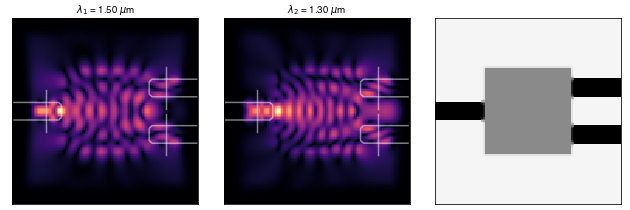

# Optical Inverse Design with Automatic Differentiation

This repository contains the code and notebooks for the workshop on the inverse design of optical devices with automatic differentiation. Below is the animation of such an optimization applied to an optical splitter.

## Contents

| Notebook | Description  |
| -------- |------------- |
| [01_First_simulation.ipynb](01_First_simulation.ipynb) | Covers the basics of setting up a finite difference frequency domain (FDFD) simulation |
| [02_Invdes_intro.ipynb](02_Invdes_intro.ipynb) | Deals with setting up and performing an inverse design optimization of a mode converter |
| [03_Invdes_parameterization.ipynb](03_Invdes_parameterization.ipynb) | Expands on Notebook 02 to introduce parameterization strategies |

The materials in this repository are organized into several [Jupyter](https://jupyter.org/) notebooks. You can interact with them through the `jupyter lab` interface, which is a web-based user interface that runs from your local computing environment. They are numbered and can be followed in order if you are just getting started with optical simulation and optimization.

## Getting started

To get started using these course materials, you can transfer them to your local computing environment either by downloading them or git cloning this repository. To download a zip archive of these materials, simply click the green "Clone or download" button on the top right corner of the GitHub repository page and then selecting "Download ZIP" from the drop down menu.

If you have `git` installed, you can enter the following command in a terminal to clone the repository:

    git clone https://github.com/fancompute/workshop-invdesign.git

You will also need a python environment with the necessary packages installed. There are several ways to setup a python environment, but we recommend using Anaconda, which can be downloaded for your operating system from: <https://www.anaconda.com/distribution/>. 

**Note:** you will want to download the distribution for a 3.X version of Python (e.g. 3.6, 3.7, or something higher). 

By default, the Anaconda distribution includes many of the python packages that we require for this workshop. However, there are a few additional packages we will need to install manually, as described in the next sections of this guide.

## Installing ceviche

Ceviche is our research group's finite difference frequency domain (FDFD) and time domain (FDTD) package. This is the primary package we will use to simulate and optimize optical devices. In case you are wondering, the word "ceviche" refers to [a seafood dish from Peru](https://en.wikipedia.org/wiki/Ceviche) that [Tyler Hughes](http://twhughes.github.io/) enjoys.

The source code for ceviche is freely available on GitHub at <https://github.com/fancompute/ceviche>. You can install ceviche by git cloning the repository into your local computing environment and adding its location to your `PYTHONPATH` environment variable. However, we recommend installing ceviche via pip, by executing the following command:

    pip install ceviche

Running this command should also install most of the dependencies for ceviche. However, we briefly describe several key dependencies below and the steps for manually installing them, if necessary.

### scikit-image

[scikit-image](https://scikit-image.org/) provides some useful utility functions for drawing shapes into 2D arrays. We can utilize these functions to help us define geometry features in our FDFD domains. To install scikit-image, execute the following command in your conda environment:

    conda install scikit-image

**Note:** this does not get installed automatically with ceviche.

### HIPS autograd

[HIPS autograd](https://github.com/HIPS/autograd) is an automatic differentiation framework with a [Numpy](https://numpy.org/)-like API. We rely on autograd for flexible gradient computation in our inverse design studies. To install autograd, execute the following command in your conda environment:

    pip install autograd

### pymkl

[pymkl](https://pypi.org/project/pyMKL/) provides an interface to the [PARDISO](https://www.pardiso-project.org/) sparse solver which we use to accelerate our simulations. We have observed approximately a 10X speed up in certain cases compared to the standard SciPy sparse linear solver routines. To install pymkl, execute the following command in your conda environment:

    pip install pymkl

## References

For more information and further reading on the concepts covered in this workshop, see our group's papers.

 - T. W. Hughes, I. A. D. Williamson, M. Minkov, and S. Fan, "Forward-mode Differentiation of Maxwell’s Equations," ACS Photonics, Oct. 2019. [doi:10.1021/acsphotonics.9b01238](https://doi.org/10.1021/acsphotonics.9b01238)

 - T. W. Hughes*, M. Minkov*, I. A. D. Williamson, and S. Fan, "Adjoint Method and Inverse Design for Nonlinear Nanophotonic Devices," ACS Photonics, Dec. 2018. [doi:10.1021/acsphotonics.8b01522](https://doi.org/10.1021/acsphotonics.8b01522)
